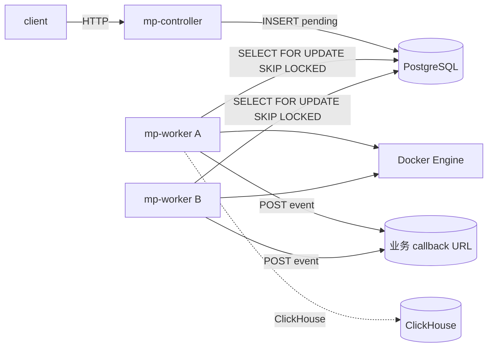
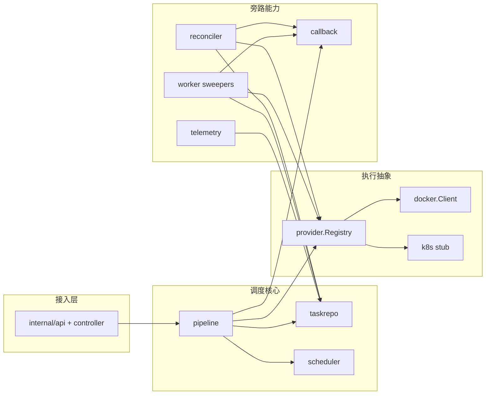

# mp_sched 体系结构

本文描述各模块的职责边界、数据流与配置要点；对应代码路径见各节。

---

## 1. 总览：双进程 + 单一事实源（PostgreSQL）

| 进程 | 入口 | 职责 |
|------|------|------|
| `mp-controller` | `cmd/mp-controller` | HTTP 校验，仅创建 `tasks` 行为 `pending`；查询；便捷构造 `stop` 与 `restart` 请求。不执行 Docker / K8s，不占并发槽。 |
| `mp-worker` | `cmd/mp-worker` | `ClaimNext` 抢占 `pending` → `processing` → `Pipeline.Dispatch`：准入、GPU 槽位校验、`Provider.ResourceCheck`、`Run`；后台跑 admitted-stuck 回收、运行超时扫描、可选 reconciler 与 telemetry。 |

两进程共用同一数据库与同一 `model.Task`（GORM）；通过状态字段协作，无进程内消息队列；排队深度由 `pending` 行数体现，配置层不设队列长度上限。

---

## 2. 模块关系

| 模块 | 路径 | 做什么 |
|------|------|--------|
| HTTP / Controller | `internal/controller/http.go`、`internal/api/*.go` | 校验 `provider` 已在 `Registry` 注册；`Enqueue` → `pipeline.Submit` 落库 `pending`；`stop` / `restart` 便捷接口 |
| Pipeline | `internal/pipeline/pipeline.go` | `Submit`（仅入库）、`Dispatch`（worker 唯一入口）：start 走 `executeStart`，stop 走 `executeStop` |
| Scheduler（纯策略） | `internal/scheduler/admit.go` | `Admit(cfg, task, counts)`：无 I/O，仅根据 `config.scheduler` 与 `RunningCounts` 返回是否进入 `admitted` |
| TaskRepo | `internal/taskrepo/repo.go` | 持久化、`ClaimNext`（`SKIP LOCKED`）、`RunningSlotCounts*`、状态 CAS、运行时记录 |
| Provider | `internal/provider/*.go` | 接口：`ResourceCheck` / `Run` / `Status` / `Stop`；实现：`internal/provider/docker`、`internal/provider/k8s` |
| Callback | `internal/callback/client.go` | 关键状态变更时向 `callback.url` POST；可配 `events` 白名单 |
| Reconciler | `internal/reconciler/reconciler.go` | 周期 `Provider.Status`，把运行中负载的终态同步回库；可选 orphan reap |
| Worker 循环 | `internal/worker/runner.go` | 轮询 `ClaimNext` → `Dispatch`；`ErrNotAdmitted` 时 `ResetToPending` 实现反压重试 |
| Worker sweepers | `internal/worker/runtime_sweep.go` | admitted 卡死回收；运行超时扫描（见第 6 节） |
| Telemetry（可选） | `internal/telemetry/` | ClickHouse 落 slog、Docker stats / 日志，旁路于主状态机 |

---

## 3. 任务状态机（start 工作负载）

| 状态 | 含义 | 谁写入 |
|------|------|--------|
| `pending` | 已入队，等待 worker | controller `Submit` |
| `processing` | worker 已 `UPDATE … SKIP LOCKED` 抢占 | `taskrepo.ClaimNext` |
| `admitted` | 通过 `scheduler.Admit`，尚未 `Run` 成功 | `pipeline.executeStart` 事务内 CAS |
| `running` | `Provider.Run` 成功，已写 `runtime_ref`、`running_at` | pipeline + `UpdateRuntime` |
| `succeeded` / `failed` / `stopped` | 终态 | pipeline、reconciler、sweeper |

并发槽 = `admitted` + `running`，且只计 start 类行（`operation != stop`）。`processing` 仅在极短窗口存在，不计入槽位（`RunningSlotCounts` 只扫 `admitted | running`）。

`operation=stop` 会新增一条 task 行（类型为 stop），`target_task_id` 指向原 start 任务；原运行行被 `Stop` 后标为 `stopped`，见 `executeStop`。

---

## 4. 主路径：从入队到 Run

### 4.1 Controller 只生产 `pending`

1. `Handlers.Validate`：`provider` 必须在 `Registry` 存在；`stop` 要求 `target_task_id`。
2. `Handlers.Enqueue` → `Pipeline.Submit`：生成 `task_id`、写 `pending`，可选 `callback.EventPending`。

### 4.2 Worker 抢占与分发

1. `ClaimNext`：对最老 `pending` 行加 `FOR UPDATE SKIP LOCKED`，原子改为 `processing`（多 worker 安全）。
2. `Pipeline.Dispatch`：要求当前已是 `processing`。
3. `executeStart` 顺序（见 `pipeline.go`）：
   - 事务内：`RunningSlotCountsWithDB` → `scheduler.Admit` → 通过则 CAS `processing` → `admitted`。
   - 若 `Admit` 拒绝：返回 `ErrNotAdmitted`；worker 不改状态，外层 `ResetToPending` 退回 `pending`，构成调度反压。
   - 事务成功后：`callback.EventAdmitted`。
   - 事务外：当 `provider=docker` 且配置了 `host_resources.gpu_ids` 时，先 `docker.CheckDockerGPUOccupancy`（见第 5 节）；再 `Registry.Get` → `ResourceCheck`（CPU / 内存上限、daemon、business 等）；任一失败则 `failed`。
   - `Run` 成功：`UpdateRuntime(..., running, runtime_ref)` 同时写 `running_at`，触发 `callback.EventRunning`。

### 4.3 `Admit` 规则

| 条件 | 拒绝原因 |
|------|----------|
| `counts.Total >= MaxConcurrentRunning` | `global_concurrent_limit` |
| `task_class=slow` 且 `counts.Slow >= MaxConcurrentSlow` | `slow_concurrent_limit` |
| `task_class=slow` 且接纳后剩余空槽 < `MinFreeSlotsForFast` | `fast_slots_reserved` |
| `operation=stop` | 不占 start 槽，直接 ok |

`Admit` 不解析 `res_cpu` / `res_memory` 数值；粗粒度资源由后续 `CheckDockerGPUOccupancy`、`ResourceCheck` 与 Provider 实现决定。

---

## 5. GPU 槽位（多重集语义）

代码：`internal/provider/docker/gpuslots.go`，在 `pipeline.executeStart` 的「事务外」阶段被调用。

- `host_resources.gpu_ids` 是数组；**每一项为一个槽位**。同一物理 device id 出现 n 次表示该卡上至多可并发 n 个任务（适合未启用 MPS / MIG 时整卡共享）。
- 单任务 `res_gpu` 用逗号分隔 device id；同一 id 重复 m 次表示本任务一次性占 m 槽。
- `res_gpu = "all"` 视为占满 `gpu_ids` 中声明的全部槽位。
- 校验：汇总当前所有 `provider=docker` 且 `status IN (admitted, running)` 的 start 任务的 `res_gpu`，按 id 求和；任一 id 总占用 > 槽位数 → 任务失败。
- 剩余槽位（旁路读取）：`docker.RemainingGPUSlots(hostCap, used)`。
- 未配置 `gpu_ids` 时不做 GPU 槽位校验，开发机兼容。

向 Docker 下发：`gpuDeviceRequests` 保留重复 device id 不去重，与「占两槽」的语义一致。

---

## 6. Worker 后台扫描

| 扫描 | 入口 | 触发条件 | 行为 |
|------|------|----------|------|
| admitted-stuck | `worker/runner.go` | `worker.admitted_timeout_seconds > 0` | `RevertAdmittedStuck`：长期 `admitted` 且 `updated_at` 太旧 → `failed` |
| runtime timeout | `worker/runtime_sweep.go` | 默认开启，`worker.disable_runtime_sweeper=false` | 扫描 `running` 任务：从 `running_at` 起超过 `effectiveMaxRuntimeSec` 则 `Stop` → `ClearRuntimeRef` → `failed` → `callback.EventTimeout` |

`effectiveMaxRuntimeSec`：

- 任务 `max_runtime_seconds < 0`：永不限时；
- `> 0`：使用任务值；
- `= 0`（API 未传或显式 0）：使用 `worker.default_max_runtime_seconds`（典型 3600）；该值为 0 时也视为不限时。

扫描周期：`worker.runtime_sweeper_interval_seconds`（≤0 且未禁用时 `ApplyDefaults` 补 300）。

Docker Engine 没有「容器最长存活时间」原生开关，只能由调度侧实现。

---

## 7. Provider 层与 Registry

| 方法 | 调用时机 |
|------|----------|
| `ResourceCheck` | `admitted` 之后、`Run` 之前。docker 侧：daemon ping、镜像非空、`business` 解析、CPU / 内存上限。GPU 槽位不在这里。 |
| `Run` | 创建并启动工作负载；返回 `runtime_ref`（如容器 ID） |
| `Status` | reconciler 周期调用，同步终态 |
| `Stop` | stop 任务、orphan 回收、运行超时扫描共用入口 |

`cmd/mp-*` 启动时把 `"docker"`、`"k8s"` 注入 `provider.Registry`；`worker.allowed_providers` 非空时 `ClaimNext` 只消费列出的 provider，便于多 worker 分片。

---

## 8. Reconciler（解耦的外向同步）

- 主 tick：列出 `admitted | running` 的 start 任务 → `Status` → 若已 `succeeded / failed / stopped`，写库并 `callback`。
- 可选 orphan reap：列出库中已终态但 `runtime_ref` 仍非空的 docker 任务 → 按 `orphan_reap_waits_s` 多次再观测 → 仍 `running` 则 `Stop` 并清空 `runtime_ref`（不改 `status`、不重复发 callback）。

配置：`reconciler.enable`、`interval_seconds`、`orphan_reap_*`。

---

## 9. Callback 事件

| 事件 | 触发位置 |
|------|----------|
| `pending` | `Pipeline.Submit` |
| `processing` | worker 抢占（如开启） |
| `admitted` | `executeStart` 事务成功 |
| `running` | `Run` 成功并写 `running_at` |
| `succeeded` / `failed` / `stopped` | pipeline、reconciler |
| `timeout` | `runtime_sweep` 强杀（语义独立于 `failed`） |

`callback.enable=true` 且 `url` 非空时才发送；`events` 非空时仅推白名单内的事件。

---

## 10. 配置与运维要点（交叉引用）

| 配置节 | 作用 |
|--------|------|
| `scheduler` | 全局与快慢槽、快任务预留，直接驱动 `Admit` |
| `worker.poll_ms` / `admitted_timeout_seconds` / `allowed_providers` | 抢占节奏、卡死 `admitted` 回收、provider 分片 |
| `worker.default_max_runtime_seconds` / `runtime_sweeper_interval_seconds` / `disable_runtime_sweeper` | 运行超时扫描 |
| `reconciler` | 对账与孤儿回收 |
| `callback` | 外推 |
| `controller.http` / `server` | API 监听端口 |
| `docker` | 全局挂载、镜像拉取、OSS、本机 `host_resources`（CPU / 内存与 `ResourceCheck`；GPU 槽位与 `gpuslots` + pipeline） |
| `clickhouse` / `telemetry` | 可选遥测落库与查询 |

详细键说明见 [`CONFIG.md`](CONFIG.md)。

---

## 11. 技术选型（保持精简）

- HTTP 路由：[go-chi/chi](https://github.com/go-chi/chi)
- 持久化：PostgreSQL + GORM；`business` / `extra` 为 JSONB
- 容器：moby/docker engine 客户端（`client.FromEnv`）
- 可选遥测：ClickHouse v2 native protocol

---

## 12. 源码索引

| 主题 | 路径 |
|------|------|
| 状态常量 | `internal/model/task.go` |
| 准入与计数 | `internal/scheduler/admit.go`、`internal/taskrepo/repo.go` |
| 执行链 | `internal/pipeline/pipeline.go` |
| Worker 循环 / 扫描 | `internal/worker/runner.go`、`internal/worker/runtime_sweep.go` |
| HTTP 入队 / restart | `internal/controller/http.go`、`internal/controller/restart.go` |
| API 路由 | `internal/api/server.go`（前缀 `RoutePrefixV1=/api/sched/v1`）、`restart.go`、`telemetry.go` |
| Docker provider | `internal/provider/docker/` |
| GPU 槽位 | `internal/provider/docker/gpuslots.go` |
| 回调 | `internal/callback/client.go` |
| 对账 | `internal/reconciler/reconciler.go` |
